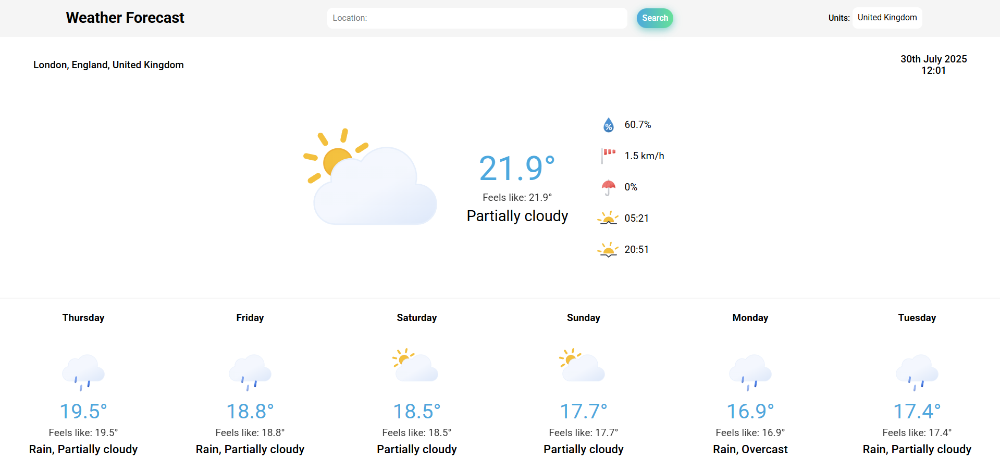

# Weather App

## Introduction
A simple, dynamic weather app that fetches real-time data using the Visual Crossing Weather API.

## Features
* __Search Any Location__: Retireve weather data for any location in the world.
* __Weather Details__: Displays temperature, weather condition, humidity, winds speed, precipitation chance and sunrise & sunset times.
* __Weekly Forecast__: Check the temperature and weather conditions for the next seven days.
* __Unit Selection__: Choose between UK, US, Metric and Base units to view weather details in your preferred format.
* __Dynamic Weather Icons__: Icons update based on real-time weather conditions.
* __Responsive Design__: Optimized for seamless use across desktops, tablets, and mobile devices.

## Technologies Used
* HTML5
* CSS3 (including Flexbox & Grid)
* JavaScript
* Webpack
* date-fns (for handling date & time formatting)
* @date-fns/tz (for handling time zones)

## Project Link
You can view this project [here](https://alexs1302.github.io/weather-app/)!

## Project Interface (Screenshot)


## Credits
The weather icons are provided by [Meteocons](https://github.com/basmilius/weather-icons), under the __MIT License__.

The license file is included in the ```src/assets/icons``` directory.

This project was created as part of The Odin Project's curriculum, a free online resource for learning web development.
